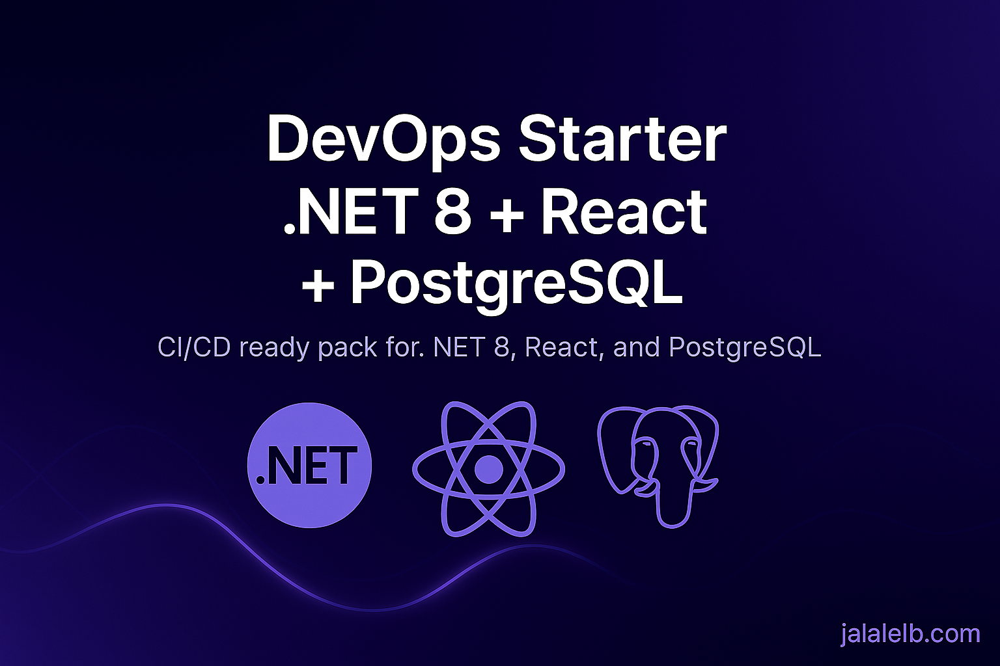

<p align="center">
  
</p>

# 🚀 Dotnet + React + Postgresql DevOps Starter (CI/CD Ready)

A **production-ready DevOps Starter Pack** built for developers who want to ship fast, monitor easily, and deploy confidently.

Includes full CI/CD pipelines, Dockerized architecture, and integrated monitoring (Grafana + Prometheus).

---

## ⚙️ Key Features
- 🐳 **Dockerized** backend & frontend  
- 🔄 **CI/CD** with GitHub Actions or GitLab  
- 📊 **Monitoring** (Prometheus + Grafana)  
- 🚀 **Ready for local & cloud deployment**

---

## 🧩 Tech Stack
.NET 8 · React · PostgreSQL · Docker · GitHub Actions · Grafana · Prometheus

---

## 🏷️ Tags
`dotnet` · `react` · `postgresql` · `devops` · `fullstack` · `docker` · `github-actions` · `cicd` · `grafana` · `prometheus` · `monitoring` · `csharp` · `template` · `starter`

---

## 📦 Get the Pack
➡️ **Gumroad**: [https://jalalelb.gumroad.com/l/dotnet-react-postgresql](https://jalalelb.gumroad.com/l/dotnet-react-postgresql)

> Looking for all stacks?  
> 👉 **DevOps Starters Collection** → [https://github.com/JalalELB/devops-starters-collection](https://github.com/JalalELB/devops-starters-collection)

---

## 📊 Example Architecture
```text
frontend ──► backend ──► database
     │              │
     └──► monitoring (Prometheus + Grafana)
```

---

## 🧑‍💻 About the Author
**Jalal El Boumeshouli** — Full-Stack & DevOps Engineer  
💼 https://www.linkedin.com/in/jalalelb  
🛒 https://jalalelb.gumroad.com
